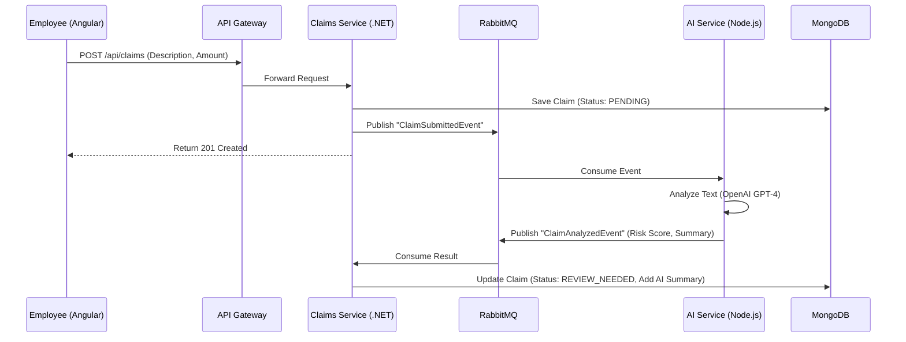

# DarwinX – AI-Powered Employee Benefits & Claims Management SaaS Platform

## 🚀 Executive Summary
DarwinX is an enterprise-grade, multi-tenant SaaS platform designed to revolutionize employee benefits management. Inspired by industry leaders like Mercer Darwin, it leverages a modern **Microservices Architecture**, **Event-Driven Design**, and **Generative AI** to streamline claims processing and enhance HR operations.

This project demonstrates professional-level expertise in the **MEAN Stack (MongoDB, Express, Angular, Node.js)**, **.NET Core**, **Kubernetes**, and **Cloud-Native Architecture**.

## 🏗️ High-Level Architecture
- **Frontend**: Angular 16+ (Enterprise structure, RxJS, Angular Material)
- **Backend**: Hybrid Microservices
  - **User & Benefits Services**: Node.js + Express (High concurrency, I/O bound)
  - **Claims Service**: .NET Core Web API (High performance, strict typing)
  - **AI Service**: Node.js + OpenAI API (GenAI integration)
- **Messaging**: RabbitMQ (Event-driven communication)
- **Database**: MongoDB (Multi-tenant data modeling)
- **Infrastructure**: Docker, Kubernetes (AKS compatible), CI/CD pipelines

## 🌟 Key Features
- **AI-Powered Claims Processing**: Automated summarization and classification of insurance claims using LLMs.
- **HR Chatbot**: 24/7 intelligent assistant for employee queries.
- **Multi-Tenancy**: Secure data isolation for multiple corporate clients.
- **Role-Based Access Control (RBAC)**: Granular permissions for Employees, HR Admins, and Platform Admins.
- **Enterprise Security**: OAuth2/JWT authentication and secure API gateway patterns.

## 🛠️ Technology Stack Justification
| Technology | Role | Why it was chosen |
|------------|------|-------------------|
| **Angular** | Frontend | Strict typing, modularity, and enterprise-ready ecosystem. |
| **Node.js** | Microservices | Non-blocking I/O, perfect for real-time updates and JSON-heavy APIs. |
| **.NET Core** | Claims Service | Performance, robustness, and strong typing for complex business logic. |
| **MongoDB** | Database | Flexible schema for evolving benefits data and multi-tenancy support. |
| **RabbitMQ** | Messaging | Decouples services, ensuring reliability and scalability. |
| **Kubernetes** | Orchestration | Manages container lifecycle, scaling, and self-healing. |

## 📂 Repository Structure
- `/frontend`: Angular application
- `/services`: Backend microservices
  - `user-service`: Auth & User Management (Node.js)
  - `benefits-service`: Benefits Catalog (Node.js)
  - `claims-service`: Claims Processing (.NET Core)
  - `ai-service`: GenAI Integration (Node.js)
- `/infra`: Docker Compose, K8s manifests, CI/CD configs
- `/docs`: Detailed architectural and design documentation

## 🚀 Getting Started
See [Usage Guide](docs/usage-guide.md) for detailed instructions on running locally or deploying to Kubernetes.

## 📸 System Visuals

### 1. Claim Submission & AI Analysis Flow
This diagram illustrates how the system handles a new claim submission using an Event-Driven approach.

### 2. Application Screenshots
*(Note: These screenshots demonstrate the application running in a local Docker environment)*

#### Claims Dashboard
The dashboard shows the list of claims with their real-time status and AI-generated insights.

*Figure 1: Employee view showing AI summaries and risk scores.*

---
*Designed and Built by [Your Name]*
