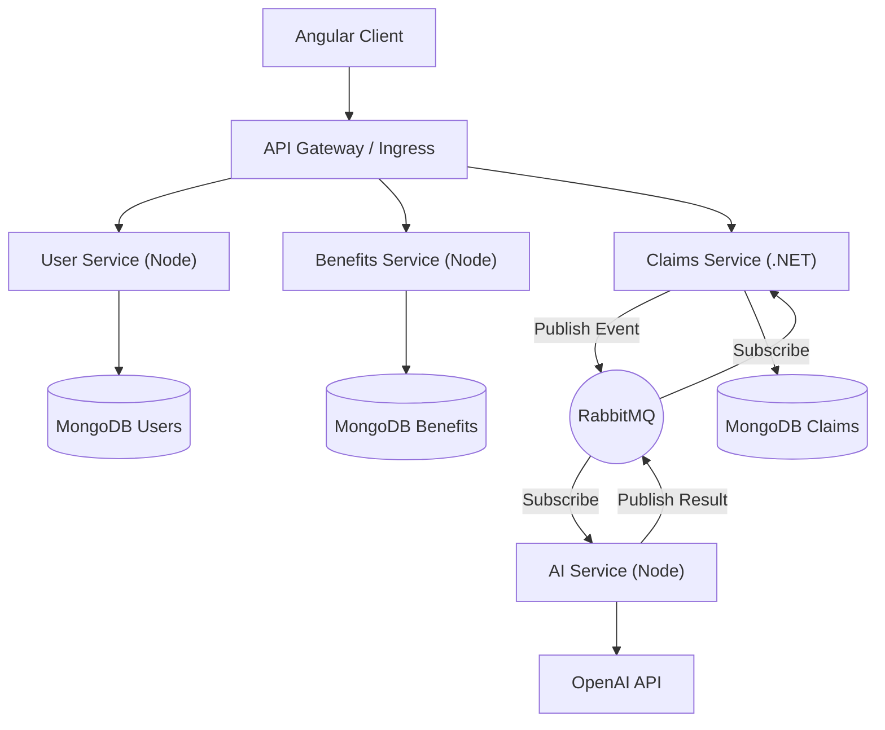

# Architecture Documentation

## 1. System Overview
 AI-Powered Employee Benefits & Claims Management SaaS Platform is designed as a **Cloud-Native Microservices Application**. It solves the problem of monolithic rigidity by breaking down the domain into loosely coupled, independently deployable services.

### Business Problem
Traditional benefits systems are:
- **Monolithic**: Hard to scale and maintain.
- **Manual**: Claims processing is slow and error-prone.
- **Opaque**: Employees lack visibility into their benefits.

### Solution
 AI-Powered Employee Benefits & Claims Management SaaS Platform provides:
- **Scalability**: Services scale independently based on load.
- **Automation**: AI accelerates claims processing.
- **Agility**: New features can be deployed without downtime.

## 2. Microservices Architecture

### Services Breakdown
1.  **API Gateway (Ingress)**: Single entry point for all client requests. Handles routing, SSL termination, and basic load balancing.
2.  **User Service (Node.js)**: Handles Authentication (OAuth2/JWT), User Management, and RBAC.
3.  **Benefits Service (Node.js)**: Manages the catalog of available benefits, enrollment logic, and plan details.
4.  **Claims Service (.NET Core)**: The core transactional engine. Handles claim submission, validation, and status updates. Chosen for .NET's strong typing and performance in complex logic.
5.  **AI Service (Node.js)**: Acts as a facade to LLM providers (OpenAI). Handles prompt engineering, context management, and response parsing.

### Communication Patterns
- **Synchronous (HTTP/REST)**: Used for direct user interactions (e.g., "Get my profile").
- **Asynchronous (RabbitMQ)**: Used for decoupling critical paths (e.g., "Claim Submitted" -> "Trigger AI Analysis").

## 3. Event-Driven Design
We use **RabbitMQ** to ensure system resilience.

**Example Flow: Claim Submission**
1.  User submits claim via Frontend -> API Gateway -> **Claims Service**.
2.  Claims Service saves to DB (Pending state).
3.  Claims Service publishes `ClaimSubmittedEvent` to RabbitMQ.
4.  **AI Service** subscribes to `ClaimSubmittedEvent`.
5.  AI Service analyzes the claim description and documents.
6.  AI Service publishes `ClaimAnalyzedEvent` with a summary and risk score.
7.  **Claims Service** consumes `ClaimAnalyzedEvent` and updates the claim record.

## 4. Technology Decisions

### Why Node.js + MEAN?
- **Unified Language**: JavaScript/TypeScript across full stack (Frontend + most Backend).
- **JSON Native**: MongoDB stores JSON, Node.js processes JSON, Angular consumes JSON. No impedance mismatch.
- **Talent Pool**: Large ecosystem of developers.

### Why .NET Core for Claims?
- **Diversity**: Demonstrates polyglot persistence and architecture skills.
- **Performance**: .NET Core is highly optimized for CPU-intensive tasks.
- **Enterprise Trust**: Many large enterprises prefer .NET for core financial/transactional systems.

## 5. Architecture Diagram

